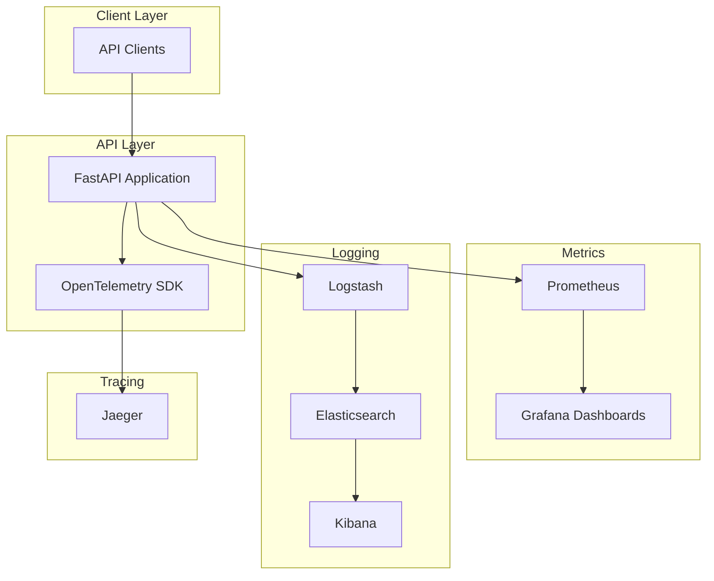
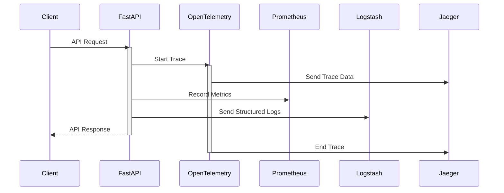
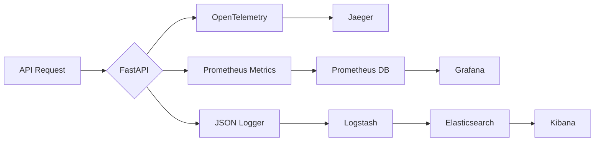
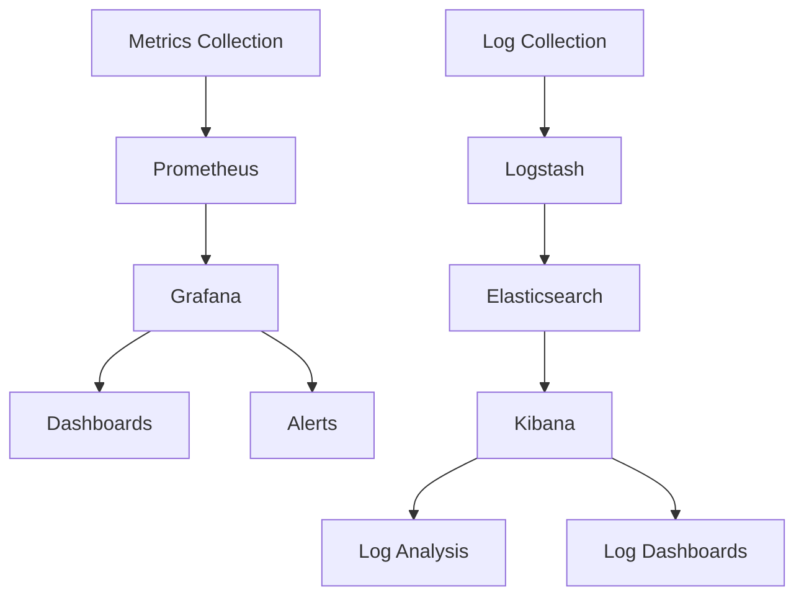

# API Observability Platform Design Document

## System Architecture

### High-Level System Diagram

### Detailed Component Interaction

## Design Decisions and Tradeoffs

### 1. Choice of Technologies

#### FastAPI
- **Pros**: 
  - High performance with async support
  - Built-in OpenAPI documentation
  - Type checking with Pydantic
- **Tradeoffs**: 
  - Requires Python 3.7+
  - Learning curve for async programming

#### OpenTelemetry
- **Pros**:
  - Vendor-neutral instrumentation
  - Wide ecosystem support
  - Auto-instrumentation capabilities
- **Tradeoffs**:
  - Additional overhead
  - Configuration complexity

#### ELK Stack
- **Pros**:
  - Powerful search capabilities
  - Rich visualization options
  - Mature ecosystem
- **Tradeoffs**:
  - Resource intensive
  - Complex configuration
  - Learning curve

### 2. Architectural Decisions

#### Containerization
- **Decision**: Use Docker for all components
- **Rationale**: 
  - Consistent environments
  - Easy scaling
  - Simplified deployment
- **Tradeoff**: Additional layer of complexity

#### Structured Logging
- **Decision**: JSON-formatted logs with context
- **Rationale**:
  - Easy parsing
  - Rich metadata
  - Better searchability
- **Tradeoff**: Increased log size

## Problem Solution Proof

### 1. Complete Observability
The solution provides:
- **Metrics**: Real-time performance data via Prometheus/Grafana
- **Logs**: Structured logging with context via ELK Stack
- **Traces**: Distributed tracing via OpenTelemetry/Jaeger

### 2. Performance Impact
- Minimal overhead:
  - Sampling for traces
  - Batched log shipping
  - Efficient metric collection

### 3. Scalability
- Each component can be scaled independently
- Distributed architecture supports high availability
- Container orchestration ready

## Known Gaps and Justifications

### 1. Limited Historical Data
- **Gap**: Default retention periods are short
- **Justification**: 
  - Can be extended based on needs
  - Most issues require recent data
  - Reduces storage costs

### 2. No APM Integration
- **Gap**: No Application Performance Monitoring
- **Justification**:
  - Core observability covered
  - Can be added later
  - Current setup sufficient for most needs

### 3. Basic Authentication
- **Gap**: Simple auth mechanisms
- **Justification**:
  - Demo environment
  - Can be enhanced for production
  - Core functionality not affected

## Implementation Details

### Data Flow

### Monitoring Setup

## Conclusion

This observability platform provides a comprehensive solution for monitoring, logging, and tracing API operations. The design choices prioritize:
- Ease of deployment
- Scalability
- Maintainability
- Extensibility

While there are some gaps, they are well-understood and can be addressed as needed. The core functionality provides robust observability capabilities suitable for most API deployments. 