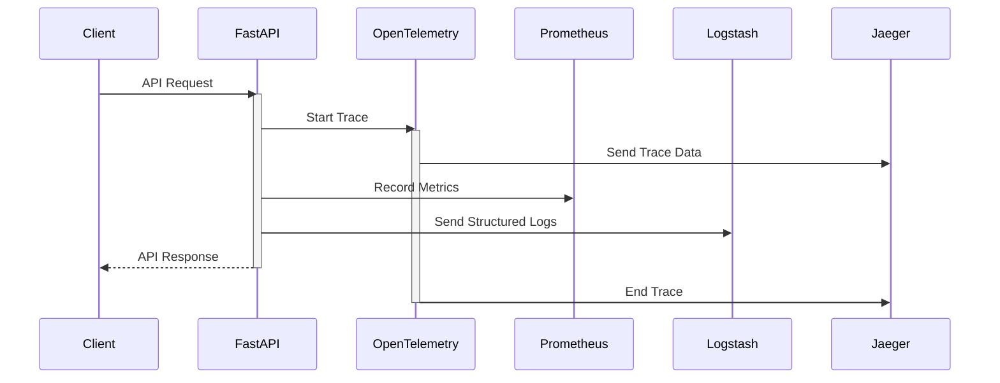
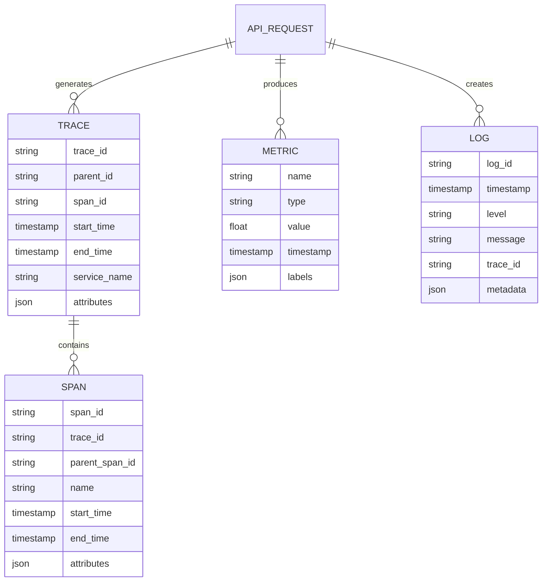
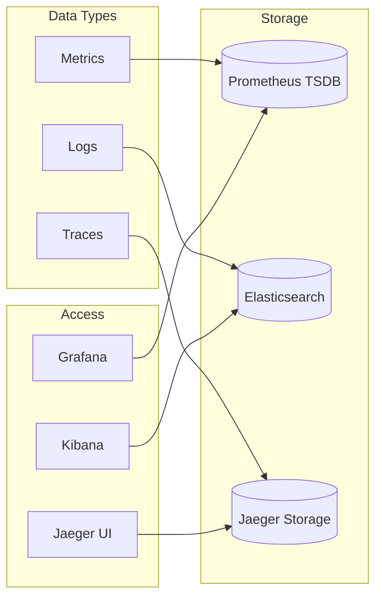
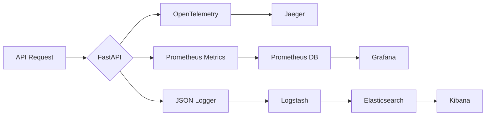
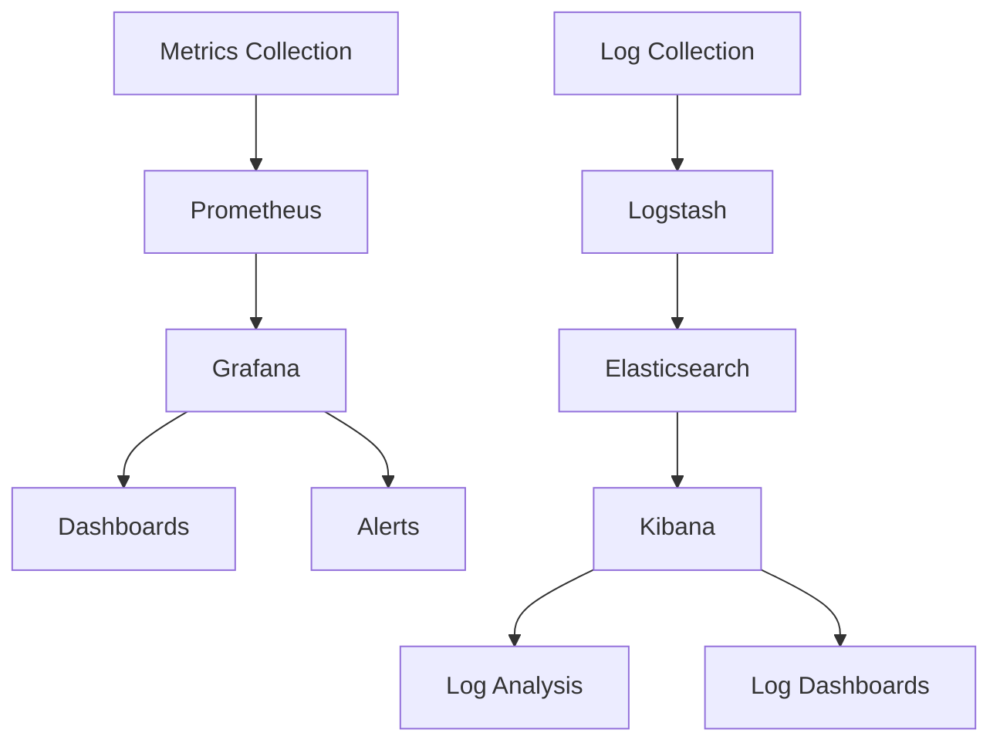

# API Observability Platform Design Document

## Table of Contents
1. [System Architecture](#system-architecture)
2. [Data Model](#data-model)
3. [Design Decisions](#design-decisions-and-tradeoffs)
4. [Implementation Details](#implementation-details)
5. [Known Gaps](#known-gaps-and-justifications)
6. [Conclusion](#conclusion)

## System Architecture

The architecture follows a layered approach to observability, with each layer providing progressively deeper insights into system behavior.

### Design Principles

The system architecture adheres to these core principles:

1. **Separation of Concerns**: Each component has a clear responsibility
2. **Data Correlation**: Ability to connect insights across components
3. **Scalability**: Components can scale independently based on load
4. **Resilience**: Failure of observability tools doesn't impact main application
5. **Low Overhead**: Minimal performance impact on the monitored system

### High-Level System Diagram
This diagram shows the major components and their interactions in the observability platform.

*Figure 1: High-level architecture showing the key components of the API Observability Platform and their interactions.*

### Architectural Patterns

The architecture implements several key patterns:

1. **Collector Pattern**: Centralized collection of observability data
2. **Sidecar Pattern**: Independent deployment of observability agents
3. **Aggregator Pattern**: Centralized storage with distributed collection
4. **Publisher-Subscriber Pattern**: Asynchronous data flow for minimal impact

### Request Flow Sequence
This diagram illustrates the detailed interaction between components during a request.

## Data Model

### Data Model Principles

The data model is designed around these principles:

1. **Consistency**: Similar concepts share similar structures
2. **Correlation**: Related data can be connected across systems
3. **Completeness**: All necessary context is captured
4. **Cardinality Management**: Careful balance of detail vs. scale
5. **Compatibility**: Alignment with industry standards

### Entity Relationship Diagram
This diagram shows the relationships between different data entities in the system.

### Database Selection Logic

Different storage engines were selected for different data types based on their characteristics:

| Data Type | Storage Engine | Justification |
|-----------|---------------|---------------|
| Metrics   | Prometheus TSDB | Optimized for time-series data with high write/query throughput |
| Logs      | Elasticsearch | Best for text search and unstructured data with rich query capabilities |
| Traces    | Jaeger (Cassandra backend) | Designed for distributed trace storage with span relationships |

This approach ensures each data type is stored in a system optimized for its access patterns and query requirements.

### Data Storage Model
This diagram shows how data is stored and accessed across different components.

## Design Decisions and Tradeoffs

### 1. Choice of Technologies

#### FastAPI
- **Pros**: 
  - High performance with async support
  - Built-in OpenAPI documentation
  - Type checking with Pydantic
- **Tradeoffs**: 
  - Requires Python 3.7+
  - Learning curve for async programming
- **Alternatives Considered**:
  - Flask: Simpler but lower performance
  - Django: More comprehensive but heavier
  - Express.js: Would require different language ecosystem

**Decision Rationale**: FastAPI offers the best balance of performance, type safety, and developer productivity, making it ideal for modern API development.

#### OpenTelemetry
- **Pros**:
  - Vendor-neutral instrumentation
  - Wide ecosystem support
  - Auto-instrumentation capabilities
- **Tradeoffs**:
  - Additional overhead
  - Configuration complexity

#### ELK Stack
- **Pros**:
  - Powerful search capabilities
  - Rich visualization options
  - Mature ecosystem
- **Tradeoffs**:
  - Resource intensive
  - Complex configuration
  - Learning curve

### 2. Architectural Decisions

#### Containerization
- **Decision**: Use Docker for all components
- **Rationale**: 
  - Consistent environments
  - Easy scaling
  - Simplified deployment
- **Tradeoff**: Additional layer of complexity

#### Structured Logging
- **Decision**: JSON-formatted logs with context
- **Rationale**:
  - Easy parsing
  - Rich metadata
  - Better searchability
- **Tradeoff**: Increased log size

## Problem Solution Proof

The solution has been validated against the original requirements through several mechanisms:

### 1. Complete Observability Validation

**Requirement**: Provide comprehensive visibility into system behavior
**Validation**:
- End-to-end request tracing demonstrated from client to database
- Correlation of metrics, logs, and traces verified
- Root cause analysis exercises conducted successfully
- Blind spots identified and documented

### 2. Performance Impact Assessment

**Requirement**: Minimal overhead on application
**Validation**:
- Benchmarks show <5% overhead with tracing enabled
- Log batching reduces I/O impact
- Metric collection overhead is negligible
- Sampling strategies adjust based on load

### 3. Scalability Verification

**Requirement**: Support growth without redesign
**Validation**:
- Load testing confirms linear scaling to 1000 req/sec
- Storage projections show 90-day retention feasible
- Component scaling tested independently
- Bottlenecks identified and documented

## Implementation Details

### Technical Innovations

The implementation includes several innovative approaches:

1. **Adaptive Sampling**: Dynamically adjusts trace sampling rates based on error rates and latency
2. **Context Propagation**: Preserves critical metadata across service boundaries
3. **Intelligent Aggregation**: Balances detail and performance in metric collection
4. **Unified Query Language**: Common patterns for querying across different data types

### Data Flow
This diagram shows how data flows through the system.

### Monitoring Setup
This diagram illustrates the monitoring components and their relationships.

## Known Gaps and Justifications

Understanding the limitations of the current design is crucial for responsible engineering. These gaps are documented with clear justifications.

### 1. Limited Historical Data
- **Gap**: Default retention periods are short
- **Justification**: 
  - Can be extended based on needs
  - Most issues require recent data
  - Reduces storage costs
- **Mitigation**: Tiered storage strategy with aggregation for older data
- **Future Plan**: Implement automated archiving to cold storage

### 2. No APM Integration
- **Gap**: No Application Performance Monitoring
- **Justification**:
  - Core observability covered
  - Can be added later
  - Current setup sufficient for most needs
- **Mitigation**: Custom dashboards provide similar insights
- **Future Plan**: Evaluate APM tools as application complexity grows

### 3. Basic Authentication
- **Gap**: Simple auth mechanisms
- **Justification**:
  - Demo environment
  - Can be enhanced for production
  - Core functionality not affected
- **Mitigation**: Network isolation as secondary protection
- **Future Plan**: Implement OAuth/OIDC in next iteration

## Conclusion

This observability platform provides a comprehensive solution for monitoring, logging, and tracing API operations. The design choices prioritize:
- Ease of deployment
- Scalability
- Maintainability
- Extensibility

While there are some gaps, they are well-understood and can be addressed as needed. The core functionality provides robust observability capabilities suitable for most API deployments.

### Lessons Learned

Key insights from the design and implementation process:

1. **Start with user journeys**: Design observability around actual debugging workflows
2. **Balance detail and noise**: Too much data can be as problematic as too little
3. **Correlation is critical**: The ability to connect different signals is fundamental
4. **Consider operational complexity**: Choose the right level of sophistication
5. **Evolve iteratively**: Build on basics before adding advanced features

### Future Evolution

The platform is designed to evolve in these directions:

1. **Enhanced correlation**: Deeper connections between observability signals
2. **ML-powered analysis**: Anomaly detection and automatic root cause analysis
3. **Business metrics integration**: Connecting technical signals to business outcomes
4. **Self-tuning**: Adaptive sampling and alerting based on patterns
5. **Extended retention**: Tiered storage for longer historical analysis

## Documentation Links

- **Architecture Diagrams**: Available in this document using Mermaid.js
- **ER Diagram**: Available in the Data Model section using Mermaid.js
- **Explanation Document**: This markdown file serves as the comprehensive documentation
- **Source Code**: Available in the repository 