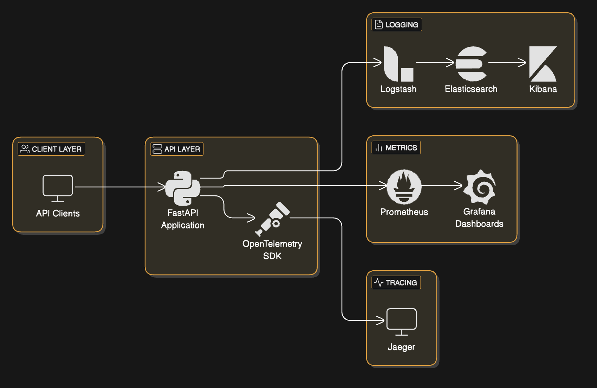

# API Observability Platform

This project demonstrates a comprehensive API observability solution using modern tools and techniques. It provides monitoring, logging, tracing, and visualization capabilities for a FastAPI application.

## Key Value Proposition

This platform addresses critical challenges in modern API development and operations:

- **Problem**: Traditional debugging approaches are reactive, time-consuming, and often require specialized knowledge
- **Solution**: Integrated observability that provides real-time visibility into system behavior
- **Outcome**: Faster troubleshooting, proactive issue detection, and reduced mean time to resolution (MTTR)

By implementing the three pillars of observability (metrics, logs, and traces) in a unified platform, teams can quickly identify, diagnose, and resolve issues in complex distributed systems.



## Documentation

For detailed information about this platform, please refer to these documentation files:

- **[API Documentation](API.md)**: Details on API endpoints, authentication, and usage examples
- **[Observability Stack](OBSERVABILITY.md)**: Information about the metrics, logging, and tracing components
- **[Dashboard Guide](DASHBOARD.md)**: Instructions for using and customizing dashboards
- **[Security Configuration](SECURITY.md)**: Security best practices and configuration guides
- **[Design Document](DESIGN.md)**: System architecture, data models, and design decisions

## Components

- **FastAPI Application**: A demo API with various endpoints that simulate different scenarios
- **Prometheus**: For metrics collection and storage
- **Grafana**: For metrics visualization and dashboards
- **OpenTelemetry & Jaeger**: For distributed tracing
- **ELK Stack**: For log aggregation and analysis
  - **Elasticsearch**: Log storage and indexing
  - **Logstash**: Log processing pipeline
  - **Kibana**: Log visualization

## Getting Started

### Prerequisites

- Docker and Docker Compose
- Python 3.11+

### Installation

1. Clone the repository
2. Run `docker-compose up -d` to start all services
3. Access the various dashboards:
   - API: http://localhost:8001
   - Prometheus: http://localhost:9091
   - Grafana: http://localhost:3000
   - Kibana: http://localhost:5601
   - Jaeger UI: http://localhost:16686

## Observability Components

### 1. Metrics with Prometheus & Grafana

The API is instrumented with Prometheus metrics that track:
- Request counts by endpoint and status code
- Response times (histograms with percentiles)
- Error rates and exception counts
- Custom application metrics
- System metrics (CPU, memory, network)

#### Using Prometheus

1. Access the Prometheus UI at http://localhost:9091
2. Use PromQL to query metrics:
   - `http_request_duration_seconds_count` - Total number of requests
   - `http_request_duration_seconds_bucket` - Request duration histograms
   - `http_requests_total{status="500"}` - Count of 500 error responses
   - `process_resident_memory_bytes` - Memory usage

#### Using Grafana

1. Access Grafana at http://localhost:3000 (login: admin/admin)
2. Prometheus is already configured as a data source
3. Explore pre-built dashboards:
   - **API Overview**: General health and performance metrics
   - **Endpoint Performance**: Detailed per-endpoint metrics
   - **Error Analysis**: Focus on error patterns and rates

#### Custom Metrics

The API exposes custom business metrics:
- `api_db_operation_duration_seconds`: Database operation timing
- `api_external_request_duration_seconds`: External API call timing
- `api_business_metrics`: Custom domain-specific metrics

### 2. Logging with ELK Stack

The API uses structured JSON logging with context enrichment:

#### Log Structure

```json
{
  "timestamp": "2023-07-20T15:04:05.123Z",
  "level": "INFO",
  "logger": "app.routes.demo",
  "message": "Request processed successfully",
  "request_id": "a1b2c3d4",
  "method": "GET",
  "path": "/demo/random",
  "status_code": 200,
  "duration_ms": 45,
  "additional_context": {...}
}
```

#### Using Kibana

1. Access Kibana at http://localhost:5601
2. Navigate to "Discover" to search and filter logs
3. Sample queries:
   - `status_code:500`: Find error responses
   - `duration_ms>500`: Find slow requests
   - `path:"/demo/random"`: Find specific endpoint logs

#### Pre-built Dashboards

Kibana includes pre-configured dashboards:
- **API Overview**: General API activity and health
- **Error Analysis**: Detailed view of error patterns
- **Performance Tracking**: Response time analysis

#### Testing Logs

Generate test logs using the provided script:
```bash
./test_elk.sh
```

### 3. Distributed Tracing with OpenTelemetry & Jaeger

The API is instrumented with OpenTelemetry to provide distributed tracing:

#### Trace Structure

- Each API request creates a parent span
- Operations like database queries and external API calls create child spans
- Spans contain attributes like:
  - HTTP method, URL, and status code
  - Database query parameters
  - Error information
  - Business context

#### Using Jaeger UI

1. Access Jaeger at http://localhost:16686
2. Search for traces by:
   - Service: "fastapi"
   - Operation: Endpoint name (e.g., "/demo/random")
   - Tags: Filter by attributes like status_code
   - Duration: Find slow traces

#### Analyzing Traces

- View the complete request flow, including nested operations
- Identify performance bottlenecks 
- Correlate traces with logs using the request_id
- Understand error propagation across services

### 4. Unified Observability

#### Correlation Between Systems

All observability data is linked through common identifiers:
- `request_id`: Connects logs and traces
- `timestamp`: Allows time-based correlation
- `endpoint`: Groups metrics, logs, and traces by functionality

#### Troubleshooting Workflows

1. **Metrics-First Approach**:
   - Start with Grafana dashboards to identify anomalies
   - Drill down to specific time periods and endpoints
   - Pivot to logs or traces for detailed investigation

2. **Logs-First Approach**:
   - Search for errors or patterns in Kibana
   - Extract request_ids from interesting logs
   - Find corresponding traces in Jaeger

3. **Trace-First Approach**:
   - Analyze slow or error traces in Jaeger
   - Understand the full request context
   - Examine detailed logs for each span

## Demo Endpoints

The API provides several endpoints to test observability features:

- `/health`: Simple health check endpoint
- `/demo/random`: Returns random numbers with trace context
- `/demo/metrics`: Returns simulated metrics data
- `/demo/echo`: Echoes back JSON payloads
- `/demo/data-echo`: Returns a fixed JSON response (good for testing)
- `/demo/slow`: Simulates slow responses with random delays
- `/demo/simple-error`: Endpoint that can generate errors on demand
- `/demo/external/{error}`: Simulates external API calls with optional errors

For detailed API documentation including authentication, parameters, and response formats, see the [API Documentation](API.md).

## Future Considerations

### Unified Dashboarding

Currently, metrics and logs are visualized in separate systems (Grafana for metrics, Kibana for logs). For a unified observability experience, consider:

- **Adding Elasticsearch as a Grafana Data Source**: This would allow visualizing logs alongside metrics in Grafana dashboards, providing a single pane of glass for all observability data.
- **Creating Combined Dashboards**: Build Grafana dashboards that show correlated metrics and logs for easier troubleshooting.
- **Implementing Alerts**: Set up alerts in Grafana based on both metrics and log patterns.

This integration would eliminate the need to switch between Grafana and Kibana when investigating issues, streamlining the monitoring and troubleshooting workflow.

## Testing

Run the included test script to verify the ELK stack and observability setup:

```bash
./test_elk.sh
```

This will check the health of all services and generate test logs and traces.

## Troubleshooting

### Common Issues

#### Services Not Starting

If any service fails to start:
1. Check the logs: `docker-compose logs [service-name]`
2. Verify port availability: `netstat -an | grep [port]`
3. Check resource constraints (memory/CPU)
4. See the [Security Configuration](SECURITY.md) guide for potential security-related issues

#### Missing Data in Observability Tools

1. **No metrics in Prometheus**:
   - Verify the API is running: `curl http://localhost:8001/health`
   - Check Prometheus targets: http://localhost:9091/targets
   - Verify scrape configuration in prometheus.yml
   - Refer to the [Observability Stack](OBSERVABILITY.md) documentation for metrics setup

2. **No logs in Kibana**:
   - Verify Logstash is receiving logs: `curl http://localhost:9600`
   - Check Elasticsearch indices: `curl http://localhost:9200/_cat/indices`
   - Generate test logs: `python tests/generate_logs.py --count 10`
   - See the [Observability Stack](OBSERVABILITY.md) documentation for logging details

3. **No traces in Jaeger**:
   - Verify Jaeger collector is running: `curl http://localhost:14268/`
   - Check environment variables for OpenTelemetry in docker-compose
   - Generate traffic with demo endpoints: `curl http://localhost:8001/demo/random`
   - Consult the [Observability Stack](OBSERVABILITY.md) for tracing configuration

#### Dashboard Issues

If you're experiencing problems with dashboards:
1. Verify all services are running properly
2. Check data source connections in Grafana
3. Ensure metrics are being collected properly
4. Refer to the [Dashboard Guide](DASHBOARD.md) for dashboard setup and customization

#### Container Modifications Not Taking Effect

If your code changes aren't reflected in the running container:
1. Check if the code is mounted as a volume or built into the image
2. For mounted volumes, changes should apply immediately
3. For built images, you need to rebuild: `docker-compose build api`
4. Restart the container: `docker restart atlan-devop-api-1`

### Data Not Persisting

If your observability data disappears after restarts:
1. Check volume configuration in docker-compose.yml
2. Verify persistence settings in Elasticsearch, Prometheus

### Performance Issues

If you experience slow performance:
1. Check resource allocation for containers
2. Monitor container stats: `docker stats`
3. Review sampling rates for tracing
4. Consider scaling Elasticsearch/Prometheus for production deployments

## Security and Production Considerations

This platform is set up as a demonstration environment. For production deployments, consider these additional measures:

### Security Enhancements

1. **Authentication & Authorization**:
   - Enable authentication for all observability tools
   - Set up proper user management and role-based access
   - Replace default credentials (particularly in Grafana and Kibana)

2. **Network Security**:
   - Restrict access to observability tools with proper network policies
   - Use TLS for all communications
   - Consider placing tools behind a reverse proxy with proper access controls

3. **Data Protection**:
   - Implement data retention policies for logs and metrics
   - Consider data anonymization for sensitive information in logs
   - Review what is being captured in traces to avoid leaking sensitive data

### Production Readiness

1. **High Availability**:
   - Set up clustered deployments for Elasticsearch
   - Configure Prometheus for high availability
   - Use load balancing for ingest components

2. **Resource Planning**:
   - Size containers based on expected traffic and data retention
   - Set up resource limits and requests for all containers
   - Monitor resource usage and scale accordingly

3. **Backup & Recovery**:
   - Implement regular backups for Elasticsearch and Prometheus
   - Document disaster recovery procedures
   - Test recovery scenarios regularly

4. **Monitoring the Monitoring**:
   - Set up alerts for the health of your observability tools
   - Monitor disk space for data stores
   - Create dashboards for observability platform metrics

### Compliance Considerations

Depending on your industry and location, consider:
- Data retention limitations
- Privacy requirements (GDPR, CCPA, etc.)
- Audit trail requirements
- Data residency concerns

By addressing these considerations, you can transform this demonstration environment into a production-ready observability platform suitable for critical applications.

## Architecture Overview

The API Observability Platform consists of several interconnected services:

- **FastAPI Application**: The main application exposing REST endpoints
- **Prometheus**: Time-series database for metrics collection and storage
- **Grafana**: Visualization and dashboarding tool for metrics
- **Jaeger**: Distributed tracing system for request flow analysis
- **ELK Stack**: 
  - Elasticsearch: Document store for logs and events
  - Logstash: Log processing pipeline
  - Kibana: Log visualization and search interface

For a detailed architecture diagram and design decisions, see the [Design Document](DESIGN.md).

When deploying this stack to production, consider:

1. **Authentication & Authorization**:
   - Secure all service UIs with strong authentication
   - Use API keys or OAuth for service-to-service communication
   - Implement role-based access control in Grafana and Kibana

2. **Network Security**:
   - Use a reverse proxy (e.g., Nginx, Traefik) with TLS
   - Restrict internal services to private networks
   - Configure appropriate firewall rules

3. **Data Security**:
   - Encrypt sensitive logs at rest
   - Implement log redaction for PII/sensitive data
   - Set up proper data retention policies

4. **Scaling**:
   - Configure Elasticsearch clustering for log volume
   - Set up Prometheus federation for large metric collections
   - Consider managed services for production deployments

For comprehensive security configurations and best practices, refer to the [Security Configuration](SECURITY.md) document.

## Core Observability Principles

This platform is built on fundamental observability principles:

1. **Instrumentation First**: Comprehensive instrumentation is built into the application from the start
2. **Correlation is Key**: All observability data is linked through common identifiers
3. **Context Preservation**: Each component captures relevant context to enable effective troubleshooting
4. **End-to-End Visibility**: Tracing spans the entire request journey from client to back-end services
5. **Performance by Design**: Observability tools are designed to minimize performance impact

These principles ensure that the platform provides actionable insights while maintaining high performance.

## Implementation Deep Dive

### Metric Selection Methodology

Metrics in this platform were selected based on:

1. **USE Method**: Utilization, Saturation, and Errors for resources
2. **RED Method**: Rate, Errors, and Duration for services
3. **Business Relevance**: Metrics that directly tie to business outcomes
4. **Cardinality Consideration**: Careful selection to avoid high cardinality issues

This methodology ensures that metrics provide maximum value while minimizing storage and performance costs.

### Log Strategy

The structured logging approach implements:

1. **Consistent Schema**: All logs follow a consistent JSON schema
2. **Context Enrichment**: Logs are automatically enriched with request context
3. **Sampling Logic**: High-volume logs implement intelligent sampling
4. **Error Amplification**: Error logs capture more detail automatically
5. **Correlation IDs**: All logs contain IDs that link to metrics and traces

This strategy balances comprehensive information with performance considerations.

### Trace Design

The distributed tracing implementation follows established best practices:

1. **Adaptive Sampling**: Sampling rates adjust based on system load
2. **Critical Path Identification**: Key operations are highlighted
3. **Context Propagation**: Context flows naturally between system components
4. **Baggage Items**: Key metadata travels with the trace context
5. **Deliberate Span Creation**: Spans are created at meaningful boundaries

This approach provides detailed visibility when needed while maintaining system performance.

## Why This Approach Works

The integrated observability platform excels because:

1. **Unified Context**: Metrics, logs, and traces share the same context, enabling seamless navigation
2. **Reduced Cognitive Load**: Consistent visualization and query patterns across tools
3. **Root Cause Analysis**: Ability to quickly narrow down from symptoms to causes
4. **Proactive Detection**: Dashboards and alerts designed to catch issues before users do
5. **Knowledge Democratization**: Reduces dependence on specialized knowledge

These advantages directly address the challenges of debugging modern distributed systems. 